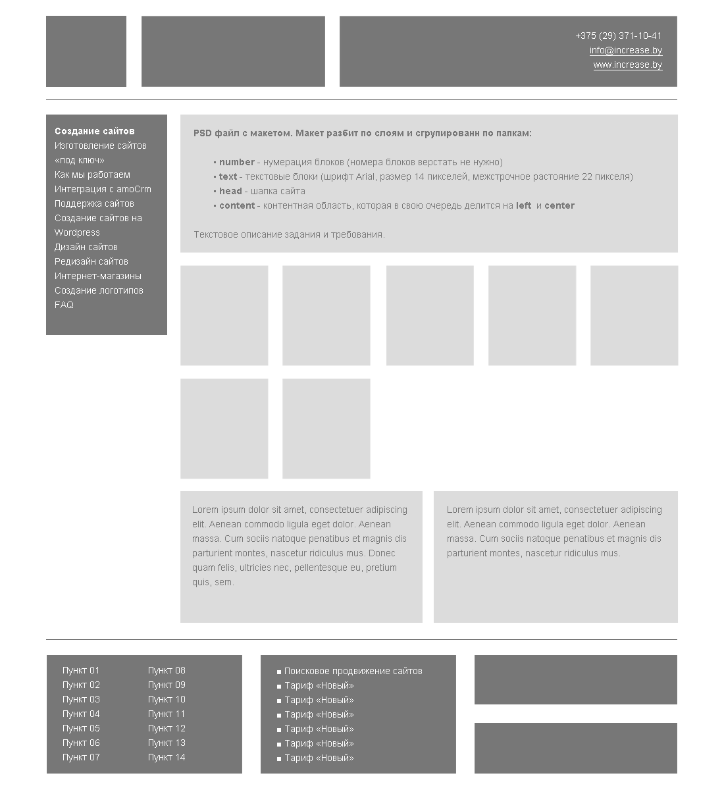

# [ INCREASE ] Тестовое задание на позицию Front-end разработчика

  /﹋\\_  
  (҂`_´)  
  <,︻╦╤─ * * *  
  /﹋\ █████████ ]▄▄▄▄▄▄▄▄  
  ▂▄▅███  JS  ███▅▄▃  
  ██████████████████  
  ◥⊙▲⊙▲⊙▲⊙▲⊙▲⊙▲⊙◥  

Ссылка для просмотра выполненного задания:
  -----------
  [Выполненное задание на Github Pages](https://mikolaosievski.github.io/increase-test-task/)

  ## Превью макета

  

Требования к верстке макета:
  -----------
  1. При добавлении контента в блоки, верстка не должна ломаться.
  2. Верстка должна быть адаптивна.
  3. Pixel Perfect не обязателен.
  4. Телефон и Email сделать кликабельными.
  5. Указать ссылки там, где вы думаете, что они должны находится.
  6. На Ваше усмотрение, использование любой технологии вёрстки.

Большим плюсом будет:
  -----------
  - BEM методология или любая другая (SMACSS, ECSS и т.д. )
  - упорядочивание CSS свойств по правилам [https://css-tricks.com/poll-results-how-do-you-order-your-css-properties](https://css-tricks.com/poll-results-how-do-you-order-your-css-properties)
